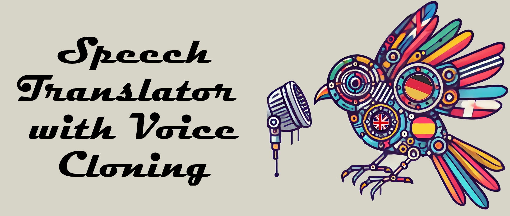

<div align="center">
  <div>&nbsp;</div>
   
</div>

# Real-Time Speech Translator with Voice Cloning: An Open-Source Modular System for Multilingual Communication

## Approach

### Structure
The system architecture follows a modular and scalable approach, designed for real-time speech translation with voice cloning. It consists of a series of independent components that work together in a pipeline to ensure accurate translation and natural voice synthesis.

1. **Voice Activity Detection (VAD)**
2. **Speech to Text (STT)**
3. **Language Model (LM) for sentence completion**
4. **Language Model (LM) for translation**
5. **Text to Speech (TTS) with voice clonation**

### Modularity

**VAD** 
- [Silero VAD v5](https://github.com/snakers4/silero-vad). Utilizes Silero VAD to efficiently detect voice intervals in the audio signal. This module reduces unnecessary computational resource usage by activating the Speech-to-Text (STT) system only when voice is detected. VAD helps reduce latency and prevents false activations.

**STT**
- [Whisper](https://huggingface.co/docs/transformers/en/model_doc/whisper). Implemented with Whisper, a robust multilingual model for voice transcription. Whisper converts the audio signal into text with high accuracy, handling different accents and noise levels. This module is critical to maintaining content integrity throughout the translation pipeline.

**LLM**
- Two [LLaMA 3.3-70B](https://huggingface.co/meta-llama/Llama-3.3-70B-Instruct) models are used in the pipeline. The first LLM acts as a contextual buffer, correcting STT errors and ensuring that phrases are complete before translation. The second LLM is dedicated exclusively to translation, ensuring that the original message remains faithful in the target language.

**TTS**
- [MeloTTS](https://github.com/myshell-ai/MeloTTS). Uses MeloTTS to generate natural voice synthesis that mimics the original speaker's vocal identity. This module enables the playback of the translated voice in a consistent and natural manner, providing an immersive experience when using the system.

## Setup

Clone the repository:

```
git clone <repository_url>
cd <repository_name>
```

Create a conda environment and install requirements:

```
conda create -n real_time_speech python=3.10
conda activate real_time_speech
pip install -r requirements.txt
```

Install MeloTTS

Follow the installation instructions provided in the [MeloTTS repository](https://github.com/EliseWindbloom/MeloTTS-Windows). Ensure MeloTTS is installed within the same conda environment to maintain compatibility.

## Usage

### Recommended setup

To run the system, simply execute the following command:

```
python s2s_pipeline.py
```

By default, the system uses the microphone as the audio input. However, you can configure it to process audio files instead. This is particularly useful for integrating with Zoom sessions or other pre-recorded audio scenarios. Additionally, configuration parameters allow you to modify the system's behavior, offering flexibility for different use cases. The detailed description in the documentation explains how to adjust these settings.

When the system is ready, it will display the message 'Ready!' (takes around 20 seconds). At this point, anything spoken into the microphone in English will be translated into Spanish and played back using a generic voice.

To clone your voice, follow the instructions provided in the section below.

### Attribute description (config.json)

---

**Module**  
- **log_level:** Sets the logging level (e.g., info, debug) for system messages.  
- **mode:** Specifies the operation mode; "local" indicates that the module runs on a local environment.

---

**VAD Handler**  
- **thresh:** The threshold for voice activity detection.  
- **sample_rate:** The audio sampling rate in Hertz.  
- **min_silence_ms:** The minimum duration (in milliseconds) of silence required to consider a break between speech segments.  
- **min_speech_ms:** The minimum duration (in milliseconds) for an audio segment to be recognized as valid speech.  
- **max_speech_ms:** The maximum allowed duration (in milliseconds) for a single speech segment.  
- **speech_pad_ms:** The padding (in milliseconds) added before and after detected speech segments.

---

**Whisper STT Handler**  
- **model_name:** The name of the Whisper model used for speech-to-text transcription.  
- **device:** The hardware device used for model execution (e.g., cuda for GPU acceleration).  
- **torch_dtype:** The data type used in PyTorch (e.g., float16).  
- **gen_max_new_tokens:** The maximum number of tokens that can be generated during transcription.  
- **gen_num_beams:** The number of beams used in beam search during the generation process.  
- **gen_return_timestamps:** Indicates whether timestamps should be returned with the transcription.  
- **gen_task:** The task for the model (e.g., "transcribe").  
- **language:** The target language for transcription (e.g., English).

---

**Language Model Handler**  
- **model_name:** The name of the language model used for translation or text generation.  
- **device:** The hardware device for running the model (e.g., cuda).  
- **torch_dtype:** The data type setting for PyTorch computations (e.g., float16).  
- **user_role:** Describes the role of the user in the conversation (in English).  
- **init_chat_role:** The initial role assigned to the chat agent (e.g., translator in Spanish).  
- **init_chat_prompt:** The prompt that sets up the chat behavior, instructing the assistant to translate exactly what the user says from English to Spanish, with no additional commentary.  
- **gen_max_new_tokens:** The maximum number of tokens to generate in a response.  
- **gen_min_new_tokens:** The minimum number of tokens required for the generated response.  
- **gen_temperature:** Controls randomness in generation; a lower value makes the output more deterministic.  
- **gen_do_sample:** A flag that indicates if sampling should be used during generation.  
- **chat_size:** The number of previous messages retained in the conversation context.

---

**Melo TTS Handler**  
- **language:** The language used for text-to-speech output.  
- **device:** The device setting for TTS processing, with "auto" allowing automatic selection.  
- **speaker_to_id:** An identifier mapping used to select the speaker profile.  
- **ckpt_path:** The file path to the MELO model checkpoint. If empty, will use the standard checkpoint.
- **config_path:** The file path to the MELO configuration file. If empty, will use the standard checkpoint.

---

### Debug Attribute description (debug_configuration.py) (also important!)

---

**DEBUG_LOGGING**  
- **DEBUG_LOGGING:** Enables logging in wandb for debugging purposes.

---

**FLUSH_VAD**  
- **FLUSH_VAD:** Time limit (in seconds) for continuous speech. If no silence is detected within this period, the pipeline proceeds with the current audio segment.

---

**USE_COMPLETION_LLM**  
- **USE_COMPLETION_LLM:** A flag to enable using an additional language model that translates only complete sentences.

---

**INPUT_DEVICES**  
- **INPUT_DEVICES:** Can be set to `None` or a tuple `(input, output)`. See the README for detailed configuration options.

---

**OUTPUT_DEVICES**  
- **OUTPUT_DEVICES:** Can be set to `None` or a tuple `(input, output)`. This setting is used with the sounddevice library.
  - **Note:** We recommend installing an Audio Virtual Cable for offline testing. Without it, the application will always connect to the default microphone and main speaker. This setup is useful for tests such as those using the Europarl dataset.

---

**EUROPARL_PATH**  
- **EUROPARL_PATH:** Specifies the file path to the Europarl dataset, which is used for offline testing.

---

## Additional Details:  

This code uses the OpenAI API, specifically the GPT-4 mini model, for convenience due to the number of users. However, other services can also be used. In our case, we have tested **novita.ai**, which, using the same Python functionality, allows running the LLaMA 3.3 model. Currently, if you set the **OPENAI_API_KEY** as an environment variable, everything works seamlessly.

## Citations

The code is based on the fantastic repo [speech-to-speech](https://github.com/huggingface/speech-to-speech) by Hugging Face!

### Silero VAD
```bibtex
@misc{Silero VAD,
  author = {Silero Team},
  title = {Silero VAD: pre-trained enterprise-grade Voice Activity Detector (VAD), Number Detector and Language Classifier},
  year = {2021},
  publisher = {GitHub},
  journal = {GitHub repository},
  howpublished = {\url{https://github.com/snakers4/silero-vad}},
  commit = {insert_some_commit_here},
  email = {hello@silero.ai}
}
```

### Distil-Whisper
```bibtex
@misc{gandhi2023distilwhisper,
      title={Distil-Whisper: Robust Knowledge Distillation via Large-Scale Pseudo Labelling},
      author={Sanchit Gandhi and Patrick von Platen and Alexander M. Rush},
      year={2023},
      eprint={2311.00430},
      archivePrefix={arXiv},
      primaryClass={cs.CL}
}
```

### Europarl
```bibtex
@inproceedings{iranzo-sanchez_europarl-st_2020,
	title = {Europarl-{ST}: {A} {Multilingual} {Corpus} for {Speech} {Translation} of {Parliamentary} {Debates}},
	shorttitle = {Europarl-{ST}},
	url = {https://ieeexplore.ieee.org/document/9054626},
	doi = {10.1109/ICASSP40776.2020.9054626},
	abstract = {Current research into spoken language translation (SLT), or speech-to-text translation, is often hampered by the lack of specific data resources for this task, as currently available SLT datasets are restricted to a limited set of language pairs. In this paper we present Europarl-ST, a novel multilingual SLT corpus containing paired audio-text samples for SLT from and into 6 European languages, for a total of 30 different translation directions. This corpus has been compiled using the debates held in the European Parliament in the period between 2008 and 2012. This paper describes the corpus creation process and presents a series of automatic speech recognition, machine translation and spoken language translation experiments that highlight the potential of this new resource. The corpus is released under a Creative Commons license and is freely accessible and downloadable.},
	urldate = {2025-02-27},
	booktitle = {{ICASSP} 2020 - 2020 {IEEE} {International} {Conference} on {Acoustics}, {Speech} and {Signal} {Processing} ({ICASSP})},
	author = {Iranzo-Sánchez, Javier and Silvestre-Cerdà, Joan Albert and Jorge, Javier and Roselló, Nahuel and Giménez, Adrià and Sanchis, Albert and Civera, Jorge and Juan, Alfons},
	month = may,
	year = {2020},
	note = {ISSN: 2379-190X},
	keywords = {Adaptation models, Europe, Filtering, Pipelines, Speech processing, Task analysis, Training, automatic speech recognition, machine translation, multilingual corpus, speech translation, spoken language translation},
	pages = {8229--8233},
}
```
